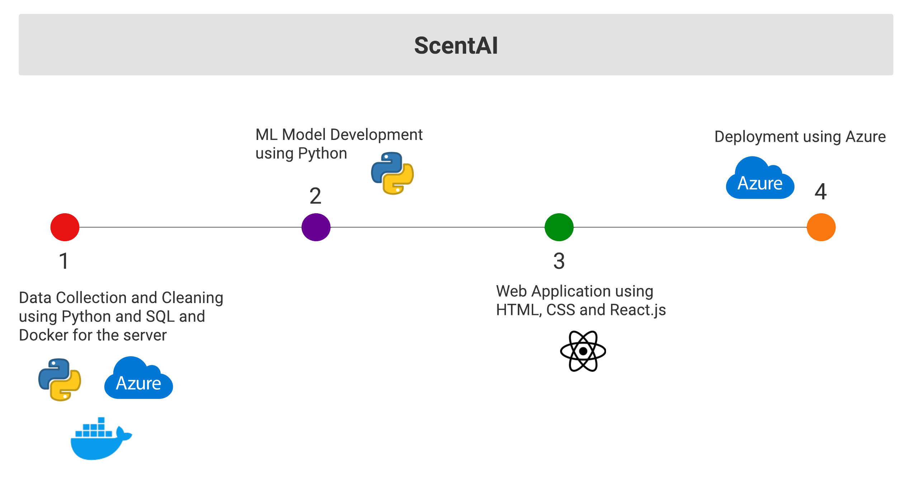

# ScentAI
Personalized fragrance: an AI-powered platform that allows customers to create their own personalized fragrance. The platform use machine learning algorithms to analyze the customer's scent preferences and recommend the perfect fragrance notes and combinations.

Dataset is from Noon, which is a large online marketplace in the Middle East, and this dataset shows the scent notes of perfume in different brands.
-----
### Model

##### Cosine Similarity Model

Cosine similarity measures the similarity between two vectors of an inner product space. It is measured by the cosine of the angle between two vectors and determines whether two vectors are pointing in roughly the same direction (more on sciencedirect).
-----

### Project Workflow

-----
### Tools 
 - Languages: Python, SQL, HTML & CSS, JavaScript
 - Software: Lucidspark, Azure Data Studio, Docker, Anaconda, Visual Studio Code, React.js

-----
References:

1. Sciencedirect.com. (n.d.). Cosine similarity. In ScienceDirect. Retrieved May 6, 2023, from https://www.sciencedirect.com/topics/computer-science/cosine-similarity
2. Abdulaziz, M. (2021). Noon Perfume. Kaggle. Retrieved May 6, 2023, from https://www.kaggle.com/datasets/monirahabdulaziz/noon-perfume

